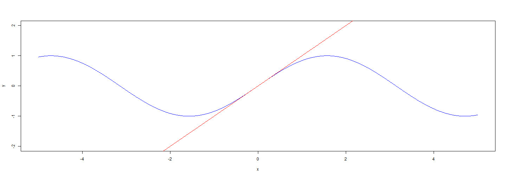
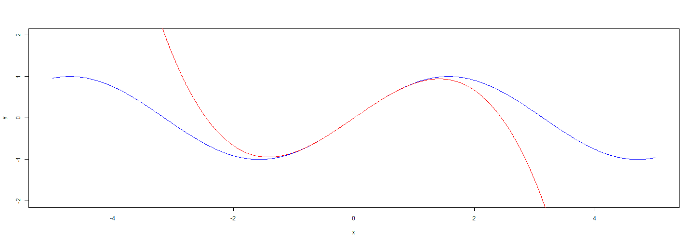

Taylor polynomials
========================================================
author: Sean Raleigh
date: 11/09/2014

Taylor polynomials
========================================================

Taylor polynomials are polynomials that best approximate a function near a point.

Taylor polynomials
========================================================

For example, suppose that we want to approximate the function $f(x) = \sin{(x)}$ near the point $x = 0$ with a straight line. A first-semester calculus class tells us the answer is just the line $T_{1}(x) = x$.

 

Taylor polynomials
========================================================

However, a cubic polynomial fits even better.

$$T_{3}(x) = x - \frac{1}{6} x^{3}$$

 

Taylor polynomials
========================================================

My Shiny app allows one to see how Taylor polynomials of various powers approximate a few common functions like $\sin{(x)}$, $\cos{(x)}$, and $e^{x}$.

The app is a little bulky to embed here, so follow this [link](http://vectorposse.shinyapps.io/devdataprod-007_project) to see the app in action!
